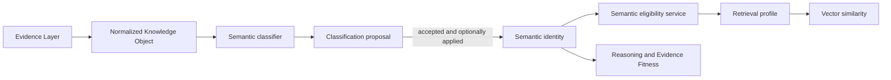
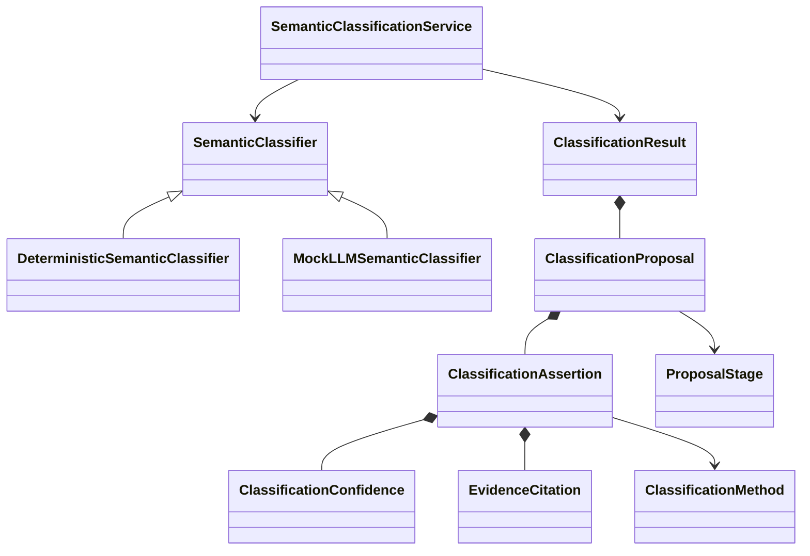

# Semantic Classification Framework

## Purpose and boundary

Semantic classification is the Semantic Layer's compiler front end. It reads a
Knowledge Object and produces an auditable proposal for its authoritative
semantic identity. It does not retrieve evidence, rank it, assess Evidence
Fitness, reason about a decision, or process the corpus in bulk.

The permanent architectural rule remains:

> Knowledge Objects store facts. Services derive meaning.

The classifier therefore proposes only identity facts supported by cited
source fields. A proposal is distinct from the Knowledge Object and cannot
change it unless an explicit acceptance policy chooses to apply it.

## Place in the architecture



Classification populates ontology. Retrieval later projects identity into
semantic eligibility and searches vector representations. Vectors do not own
semantic meaning, and the classifier does not perform retrieval.

## Contracts



- `SemanticClassifier` is the common proposal-producing interface.
- `ClassificationProposal` groups assertions for one Knowledge Object and has
  a `proposed`, `accepted`, or `rejected` lifecycle.
- `ClassificationAssertion` proposes one semantic-identity field. It carries
  its own confidence, method, and one or more evidence citations.
- `EvidenceCitation` can identify a normalized source field, Knowledge Object,
  chunk, excerpt, or page reference. The current deterministic adapters cite
  normalized Knowledge Object fields.
- `ClassificationResult` records whether policy automatically accepted and/or
  applied the proposal.
- `ClassificationMetrics` reports aggregate service-run counts. These are
  operational classification statistics, not an Evidence Fitness score.

`ClassificationMethod` initially supports `deterministic_rule`, `adapter`,
`registry_lookup`, `llm`, `manual`, and `unknown`.

## Why proposals exist

A classifier is capable of error even when its output is usually accepted
automatically. The proposal boundary provides an audit trail and permits
sampling, low-confidence review, high-consequence review, rejection, and later
quality measurement without forcing mandatory human approval.

Application is deliberately two-step:

1. classify into a proposal;
2. accept it, then optionally apply its proposed `SemanticIdentity` to the
   matching Knowledge Object.

Object IDs and source facts are not changed. Rejected proposals cannot be
applied. The framework does not persist proposals or run a corpus backfill in
this version.

## Confidence belongs to assertions

A document can support one identity fact strongly and another weakly. A single
document-level confidence would hide that distinction. Every assertion has a
bounded confidence from 0 to 1 and a rationale. Proposal average and minimum
confidence are transparent summaries used by acceptance/review policy; they
are not opaque composite judgments.

For example, an adapter may know an object's type exactly while a future
registry lookup has less confidence in an organizational relationship. Those
facts must remain separately inspectable.

## Deterministic classification first

When an adapter has already normalized an explicitly published field, the
classifier should use that field rather than ask a model to rediscover it.
Version 1 includes deterministic classifiers for:

- constitutional Knowledge Objects;
- faculty directory observations;
- course-offering observations;
- catalog publication, academic-unit, faculty-roster, and faculty observations.

These classifiers propose object type, explicitly represented institutional
entities, temporal scope, explicit authority metadata, and limited
institutional relevance when the source contract provides it. They do not
resolve identities, infer departments, assign decision domains, derive
relationships, or judge constitutional alignment.

Example proposal shape (abridged):

```json
{
  "knowledge_object_id": "faculty-observation-id",
  "classifier_name": "faculty_observation_classifier",
  "stage": "proposed",
  "assertions": [
    {
      "field_name": "object_type",
      "value": "faculty_observation",
      "confidence": {"score": 1.0},
      "classification_method": "adapter",
      "supporting_evidence": [
        {
          "source_kind": "knowledge_object_field",
          "field": "object_type",
          "knowledge_object_id": "faculty-observation-id"
        }
      ]
    }
  ]
}
```

## Service and policy

`SemanticClassificationService` selects the first supporting registered
classifier, produces a proposal, records metrics, and applies explicit policy.
By default, fully supported deterministic assertions at or above the automatic
acceptance threshold are accepted. Applying them remains opt-in. Lower
confidence proposals stay proposed and can be flagged by the review threshold.

The service exposes:

- number classified;
- methods used;
- average proposal confidence;
- number requiring review;
- number automatically accepted.

Unsupported Knowledge Object types fail explicitly and remain unmodified. This
is intentional backward compatibility: version 1 does not guess at generic
documents or classify the SEC Drive.

## Future LLM integration

`MockLLMSemanticClassifier` defines the integration boundary but has no prompt,
API client, network call, or production parsing. A future implementation must:

1. receive a bounded Knowledge Object representation;
2. emit field-level assertions through the same contracts;
3. attach `llm` method, confidence, and precise evidence citations to every
   assertion;
4. undergo schema validation before producing a proposal;
5. use acceptance policy appropriate to confidence and consequence.

Deterministic and registry-backed classifiers should run first. LLM
classification should address only identity facts not available through known
source fields, and it must not silently overwrite deterministic assertions.

## Evaluation workflow

Future evaluation can sample proposals by object type, method, confidence, or
lifecycle stage. Reviewed outcomes can measure assertion-level precision,
coverage, calibration, disagreement, and citation quality. Those results can
inform acceptance thresholds without turning classification into Evidence
Fitness.

The likely evolution is:

1. expand deterministic adapters for factual source contracts;
2. introduce reviewed registries for stable institutional entities;
3. persist proposal/audit records separately from Knowledge Objects;
4. add bounded LLM classifiers with fixture-based evaluation;
5. derive semantic memberships from accepted identity facts;
6. perform an explicitly managed backfill only after evaluation.

No embeddings, chunks, vectors, retrieval behavior, or existing corpus objects
need to change for this framework to exist.
