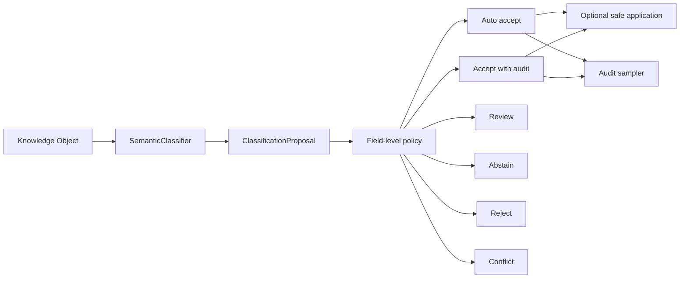

# Classification Policy and Evaluation

## Purpose

The Semantic Classification Framework transforms normalized factual evidence
into proposed semantic identity. Policy and evaluation make that transformation
safe to operate at scale. They answer which individual assertions can be
accepted, which require review, where the system abstains, where classifiers
conflict, and whether classifier behavior remains accurate on reviewed cases.

This is a Semantic Layer governance capability. It does not classify the full
corpus, modify retrieval, derive semantic memberships, or rebuild chunks,
embeddings, or vectors.

> Knowledge Objects store facts. Services derive meaning.

Semantic Identity remains authoritative factual metadata. A classification
proposal remains an inspectable intermediate artifact until policy accepts one
or more assertions and an explicit caller chooses to apply them.

## Operating model

```text
classify broadly
        |
        v
auto-accept deterministic and validated cases
        |
        v
audit representative samples
        |
        v
review ambiguous or consequential cases
        |
        v
improve rules and registries
        |
        v
re-evaluate
```

Human review governs rules, thresholds, registries, exceptions, audit results,
and high-consequence cases. It is not a requirement that a person approve every
adapter-derived object type or every unambiguous catalog year.

## Decision flow



`app/classification/policy.py` provides:

- `ClassificationPolicy` and `FieldPolicy`;
- `ClassificationDecision` and per-assertion `AssertionDecision`;
- `ClassificationDisposition`;
- `PolicyReason` and `ClassificationConflict`;
- `ClassificationAbstention` and `ClassificationGovernor`;
- `AuditPolicy`, `AuditCandidate`, and `AuditSelection`.

## Field- and method-aware policy

Confidence alone is insufficient. A confidence value has different meaning
when it comes from a structured adapter, a registered deterministic rule, an
ambiguous registry lookup, a model, or a manual assertion. Policy considers:

- the semantic identity field;
- classification method;
- assertion-level confidence;
- structural adequacy of citations;
- conflicts with accepted identity or competing proposals;
- the consequence of accepting the field.

Default policy permits highly confident, cited `adapter` and
`deterministic_rule` assertions to auto-accept. Registry lookup uses a stricter
threshold. Manual assertions may be accepted when structurally valid. LLM
assertions are review-only in version 1, regardless of confidence. `unknown`
methods abstain.

Authority, organizational relationships, decision domains, and institutional
relevance are marked for audit even when their source and confidence permit
acceptance. These policies are explicit data contracts and can be replaced for
a bounded evaluation without altering classifiers.

## Evidence requirements

Every assertion already requires at least one `EvidenceCitation`. Policy also
checks that each citation has a source kind and a usable locator such as a
Knowledge Object field, Knowledge Object ID, chunk ID, excerpt, or page
reference. Citation attributes can record policy predicates without changing
the cited fact: registered deterministic rules must report satisfied predicates
and an unambiguous result, while registry lookups must report a unique match to
an existing canonical entity with no competing match above threshold. Without
those facts, these methods enter review rather than auto-accept. Citation
validation establishes traceability only. It does not use a model to judge
whether quoted prose is substantively correct.

An uncited or structurally unusable assertion cannot auto-accept.

## Conflict and abstention

Conflict detection is deterministic and field-scoped. Version 1 detects:

- incompatible scalar values such as object type, authority, or temporal scope;
- competing sole department identifications;
- incompatible exclusive `belongs_to`, `published_by`, or `governs`
  relationships with the same source;
- disagreement with an existing accepted Semantic Identity.

Complementary multi-value facts are not automatically conflicts. Policy does
not probabilistically reconcile incompatible values. A conflict blocks the
affected assertion from application while other accepted fields may proceed.

Abstention is a valid outcome, not a failed classification. The governor emits
an explicit abstention for unsupported object types. Individual assertions
abstain when their method is unknown, their citation is inadequate, or they
fall below policy thresholds. Ambiguous registry and future model classifiers
can use the same reason-bearing outcome.

## Safe partial application

`ClassificationDecision.apply_to_knowledge_object()` applies only assertions
with `auto_accept` or `accept_with_audit` dispositions. It:

- leaves review, abstained, rejected, and conflicted assertions unapplied;
- merges multi-value identity fields rather than erasing existing entries;
- merges institutional-relevance mappings;
- preserves the deterministic Knowledge Object ID;
- records classifier, accepted fields, methods, and a deterministic decision
  fingerprint in `classification_provenance`;
- avoids duplicate provenance on repeated application.

Dry-run is the default. `SemanticClassificationService` remains backward
compatible while exposing its field-level policy decision in
`ClassificationResult.policy_decision`. Full-proposal acceptance occurs only
when every assertion is accepted; partial application follows the decision's
accepted assertions.

## Deterministic audit sampling

Audit selection operates only on decisions containing accepted assertions. A
SHA-256-derived seeded fraction makes percentage sampling reproducible and
independent of input ordering. Policy can also enforce minimum samples per
classifier and object type, select assertions near standard acceptance
thresholds, and always select fields marked `accept_with_audit`.

The output is a deterministic list of candidate keys and reasons. It does not
provide a review UI or modify Knowledge Objects.

## Evaluation dataset

`config/classification_evaluation_cases.yaml` is a small reviewed contract, not
a corpus backfill. Cases define:

- a synthetic Knowledge Object fixture;
- exact expected assertions;
- acceptable extra assertions;
- forbidden assertions;
- expected abstention reason codes;
- expected conflict fields;
- expected classification method;
- explanatory notes.

The initial cases cover constitutional, faculty-directory, course-offering,
catalog-publication, academic-unit, and department-roster objects, plus an
unsupported object and an existing-identity conflict. Fixtures contain no
institutional conclusions and require no production evidence artifacts.

## Metrics and quality gates

`app/classification/evaluation.py` reports separate, inspectable metrics:

- case and assertion counts;
- exact-match precision, recall, and F1;
- proposal coverage and abstention rate;
- false positives and forbidden assertions;
- auto-accept, review, conflict, and audit-selection rates;
- precision/recall/F1 breakdowns by field, classifier method, and object type.

There is deliberately no aggregate quality score. Quality gates can require no
forbidden assertions, minimum precision or coverage, cited automatic
acceptance, and no acceptance of conflicted assertions. Initial deterministic
fixtures default to precision 1.0. Future LLM classifiers must receive their
own evaluated policies rather than inheriting a broad production threshold.

Run the evaluation from the repository root:

```bash
python3 scripts/evaluate_semantic_classification.py
python3 scripts/evaluate_semantic_classification.py --verbose
python3 scripts/evaluate_semantic_classification.py --json-output -
python3 scripts/evaluate_semantic_classification.py \
  --cases config/classification_evaluation_cases.yaml \
  --minimum-precision 1.0
```

The command exits nonzero when a case expectation or configured quality gate
fails. It performs no network, model, embedding, FAISS, or LLM operation.

## Future LLM governance

A later LLM classifier must emit the same field-level assertions and citations
as deterministic classifiers. Before any broad use, reviewed evaluation cases
should measure field-specific precision, abstention, conflict, and calibration.
Policy can then route high-confidence but consequential fields to audit,
ambiguous fields to review, and insufficient evidence to abstention. Model
confidence alone will never authorize an identity change.

Full-corpus classification, proposal persistence, reviewer interfaces,
semantic-membership derivation, and production LLM prompting remain explicitly
outside version 1.
